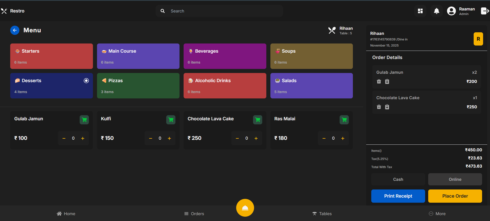
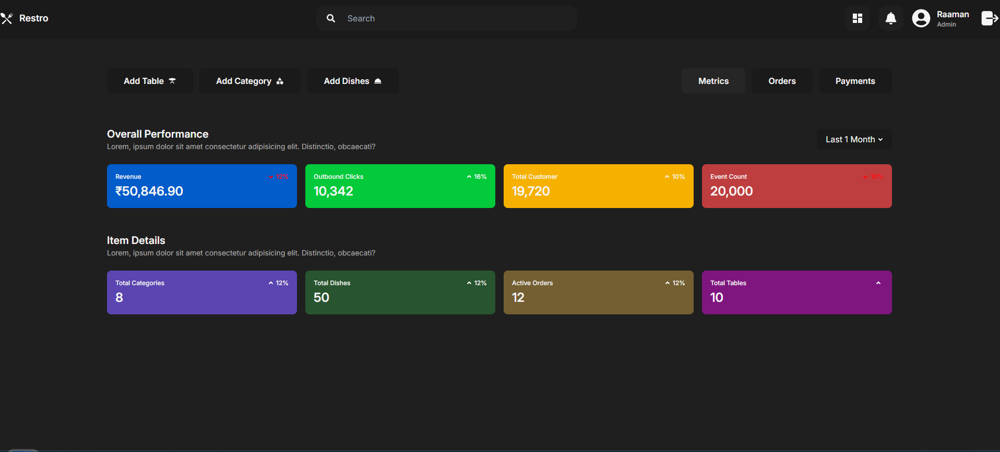
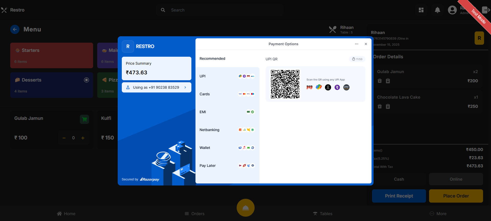
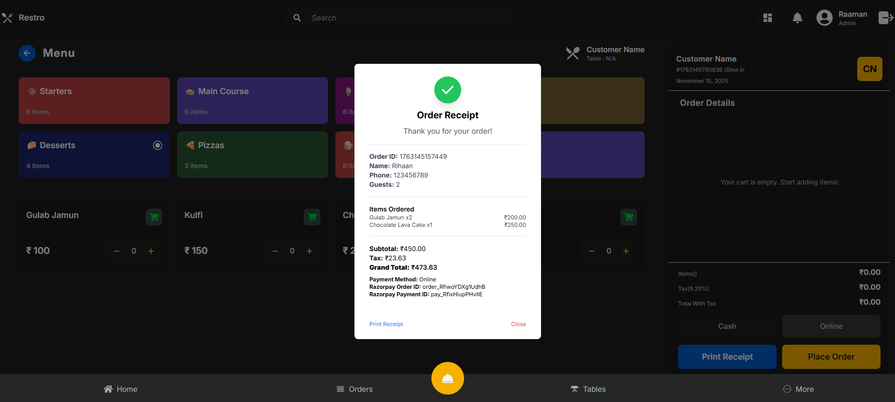

# QR-Based Smart Ordering System

A modern restaurant ordering system that allows customers to place orders using a QR code. Customers can scan a table-specific QR code, browse the menu, add items to cart, and place orders — all from their mobile device. This reduces wait times, improves service efficiency, and enhances customer experience.

---

## 📌 Table of Contents

- 🧠 About
- 🚀 Features
- 🛠️ Technologies Used
- 🧩 Architecture
- 📁 Project Structure
- 💻 Installation & Setup
- 📦 Usage
- 👥 Contributors
- 📄 License

---

## 🧠 About

The **QR-Based Smart Ordering System** allows restaurants to go digital and contactless. Each table has a unique QR which, when scanned, opens the menu for that table. Customers can:

✔ Browse menu categories  
✔ View item images, descriptions, prices  
✔ Add items to cart  
✔ Confirm and place orders  
✔ Get order status

This system helps restaurants streamline operations and boost customer satisfaction.

---

## 🚀 Features

✨ Scan QR code to open the menu  
🍔 Dynamic menu display (categories & items)  
🛒 Add to cart & place order  
📱 Mobile-friendly UI  
🔔 Order status notifications  
💼 Admin dashboard (manage menu & orders)

---

## 🛠️ Technologies Used

| Part | Technology |
|------|------------|
| Frontend | HTML, CSS, JavaScript, Bootstrap |
| Backend | Node.js / Express (or PHP / Python Flask) |
| Database | MongoDB / MySQL |
| QR Code | QR Code Generator library |
| Deployment | Heroku / Firebase / Vercel |

> ⚙️ (*Adjust based on your actual stack*)

---

## 🧩 System Architecture

1. **User (Customer)**  
   - Scans QR code  
   - Views menu  
   - Places orders

2. **Server**  
   - Handles API endpoints  
   - Processes orders  
   - Stores data in DB

3. **Database**  
   - Stores menu, orders, tables, statuses

4. **Admin/Staff Panel**  
   - Manages menu  
   - Tracks active orders

---

## 📸 Screenshots

### 📱 Customer Menu Page

### 🛒 Cart & Order Confirmation

### 🧑‍🍳 Admin Dashboard

### 🔗 CheckOut Page

### 🧑‍🍳 Invoice Page

